<div align="center">
  <h1>📜 Contributor Covenant Code of Conduct</h1>
  <p><strong>Crowdfunding Trading Platform (CFP)</strong></p>
  <p>
    
    
  </p>
</div>

---

## 📋 Table of Contents

- [🎯 Our Pledge](#-our-pledge)
- [✨ Our Standards](#-our-standards)
- [👥 Community Expectations](#-community-expectations)
- [🛡️ Enforcement Responsibilities](#️-enforcement-responsibilities)
- [🌐 Scope](#-scope)
- [🚨 Enforcement](#-enforcement)
- [⚖️ Enforcement Guidelines](#️-enforcement-guidelines)
- [📝 Reporting Process](#-reporting-process)
- [❓ Frequently Asked Questions](#-frequently-asked-questions)
- [🌍 Diversity Statement](#-diversity-statement)
- [🤝 Community Guidelines](#-community-guidelines)
- [📚 Resources](#-resources)
- [📜 Attribution](#-attribution)

---

## 🎯 Our Pledge

We as members, contributors, and leaders pledge to make participation in our community a harassment-free experience for everyone, regardless of age, body size, visible or invisible disability, ethnicity, sex characteristics, gender identity and expression, level of experience, education, socio-economic status, nationality, personal appearance, race, caste, color, religion, or sexual identity and orientation.

We pledge to act and interact in ways that contribute to an open, welcoming, diverse, inclusive, and healthy community.

### Our Core Values

| Value | Description |
|-------|-------------|
| 🌟 **Respect** | Treat everyone with dignity and respect |
| 🤝 **Collaboration** | Work together towards common goals |
| 📖 **Transparency** | Be open and honest in communications |
| 🌱 **Growth** | Support learning and development for all |
| 🛡️ **Safety** | Create a safe environment for everyone |
| 🎯 **Excellence** | Strive for quality in all contributions |

---

## ✨ Our Standards

### ✅ Positive Behaviors

Examples of behavior that contributes to a positive environment for our community:

| Category | Behavior | Examples |
|----------|----------|----------|
| **Empathy** | Demonstrating empathy and kindness | Acknowledging others' feelings, offering help to newcomers |
| **Respect** | Respecting differing viewpoints | Listening actively, considering alternative approaches |
| **Communication** | Using welcoming and inclusive language | Avoiding jargon, explaining technical concepts |
| **Feedback** | Giving and accepting constructive feedback | Offering specific suggestions, thanking reviewers |
| **Responsibility** | Accepting responsibility for mistakes | Apologizing when wrong, learning from errors |
| **Community Focus** | Prioritizing the community's best interests | Mentoring newcomers, sharing knowledge freely |
| **Patience** | Being patient with those who are learning | Answering questions thoroughly, providing resources |
| **Recognition** | Acknowledging others' contributions | Thanking contributors, crediting ideas |

### Positive Communication Examples

```markdown
# ✅ Good Examples

"Thank you for your contribution! I have a suggestion that might improve the code..."

"I understand your perspective. Here's another way to think about it..."

"Welcome to the project! Feel free to ask questions anytime."

"Great question! Here's a resource that might help..."

"I made a mistake in my previous comment. Thank you for the correction."
```

### ❌ Unacceptable Behaviors

Examples of unacceptable behavior:

| Category | Behavior | Why It's Harmful |
|----------|----------|------------------|
| **Sexualized Content** | Sexual language, imagery, or advances | Creates hostile environment, objectifies individuals |
| **Harassment** | Deliberate intimidation, stalking, following | Causes fear, distress, and exclusion |
| **Trolling** | Inflammatory comments designed to provoke | Derails discussions, wastes community time |
| **Insults** | Derogatory comments or personal attacks | Hurts individuals, damages community trust |
| **Discrimination** | Exclusionary jokes or comments | Marginalizes groups, creates unwelcoming environment |
| **Privacy Violations** | Publishing private information (doxxing) | Endangers individuals, violates trust |
| **Unprofessional Conduct** | Behavior inappropriate in professional settings | Undermines community standards |
| **Retaliation** | Punishing those who report violations | Silences victims, perpetuates harm |

### Unacceptable Communication Examples

```markdown
# ❌ Bad Examples (Never Do These)

"That's a stupid question."

"If you can't figure this out, you shouldn't be coding."

"This is obvious to anyone who knows what they're doing."

Any comment attacking someone's identity, background, or personal characteristics.

Sharing someone's personal information without consent.
```

---

## 👥 Community Expectations

### For All Community Members

| Expectation | Description |
|-------------|-------------|
| 📖 **Read First** | Read and understand this Code of Conduct before participating |
| 🗣️ **Communicate Respectfully** | Use inclusive, welcoming language in all interactions |
| 🤝 **Be Collaborative** | Work with others in good faith towards shared goals |
| 🎯 **Stay On Topic** | Keep discussions relevant and constructive |
| 🔒 **Respect Privacy** | Never share others' personal information |
| ⚠️ **Report Issues** | Report violations promptly and thoroughly |
| 🌱 **Help Others Grow** | Mentor newcomers and share knowledge |
| 🙏 **Be Graceful** | Accept feedback gracefully and give it constructively |

### For New Contributors

| Tip | Description |
|-----|-------------|
| 👋 **Introduce Yourself** | Say hello in discussions when you first join |
| ❓ **Ask Questions** | There are no stupid questions - we all started somewhere |
| 📚 **Read Documentation** | Familiarize yourself with project docs before contributing |
| 👀 **Observe First** | Watch how others interact before jumping in |
| 🐛 **Start Small** | Begin with small contributions to learn the workflow |
| 🙏 **Be Patient** | Reviews and responses may take time |

### For Experienced Contributors

| Responsibility | Description |
|----------------|-------------|
| 🎓 **Mentor Others** | Help newcomers learn the ropes |
| 📝 **Document Knowledge** | Share what you know through documentation |
| 🔍 **Review Thoughtfully** | Provide constructive, educational code reviews |
| 🌟 **Lead by Example** | Model the behavior you want to see |
| 🤝 **Bridge Gaps** | Help connect different parts of the community |

### For Maintainers

| Duty | Description |
|------|-------------|
| ⚖️ **Fair Enforcement** | Apply rules consistently and fairly |
| 🔒 **Protect Privacy** | Keep reporter information confidential |
| 📝 **Document Actions** | Record all enforcement decisions |
| 🤝 **Lead by Example** | Demonstrate exemplary community behavior |
| 📢 **Communicate Clearly** | Explain decisions transparently |
| 🛡️ **Protect the Community** | Take action to maintain a safe environment |

---

## 🛡️ Enforcement Responsibilities

Community leaders are responsible for clarifying and enforcing our standards of acceptable behavior and will take appropriate and fair corrective action in response to any behavior that they deem inappropriate, threatening, offensive, or harmful.

### Leader Responsibilities

| Responsibility | Description |
|----------------|-------------|
| **Clarify Standards** | Make sure everyone understands expectations |
| **Monitor Behavior** | Watch for violations in community spaces |
| **Respond to Reports** | Investigate all reports promptly and fairly |
| **Take Action** | Enforce consequences for violations |
| **Communicate Decisions** | Explain moderation decisions when appropriate |
| **Protect Reporters** | Maintain confidentiality of those who report |

### Moderation Powers

Community leaders have the right and responsibility to:

- ✏️ Remove, edit, or reject comments, commits, code, wiki edits, issues, and other contributions
- 🔇 Temporarily or permanently silence or remove participants
- 🚫 Ban users who violate the Code of Conduct
- 📢 Communicate reasons for moderation decisions

---

## 🌐 Scope

This Code of Conduct applies within all community spaces, and also applies when an individual is officially representing the community in public spaces.

### Where This Applies

| Space | Examples |
|-------|----------|
| **GitHub** | Issues, Pull Requests, Discussions, Code Reviews |
| **Communication** | Discord, Slack, Mailing Lists, Forums |
| **Events** | Meetups, Conferences, Online Events |
| **Social Media** | When representing the project |
| **Email** | Project-related communications |
| **Offline** | In-person interactions at events |

### Representing the Community

Examples of representing our community include:

- Using an official e-mail address
- Posting via an official social media account
- Acting as an appointed representative at an online or offline event
- Contributing to the project repository
- Participating in project discussions, issues, or pull requests
- Speaking about the project at conferences or meetups
- Wearing project merchandise at events

---

## 🚨 Enforcement

Instances of abusive, harassing, or otherwise unacceptable behavior may be reported to the community leaders responsible for enforcement.

### 📧 Contact Information

| Contact Method | Details |
|----------------|---------|
| **Project Maintainer** | Masum Jia |
| **GitHub Profile** | [@jiaamasum](https://github.com/jiaamasum) |
| **GitHub Issues** | [Report an Issue](https://github.com/jiaamasum/CFP-MVP/issues) |
| **Private Report** | Use GitHub's private vulnerability reporting |

### Response Commitment

| Metric | Commitment |
|--------|------------|
| **Acknowledgment** | Within 24 hours |
| **Initial Response** | Within 48 hours |
| **Investigation** | Within 7 days |
| **Resolution** | Within 14 days (complex cases may take longer) |

### Confidentiality

All complaints will be reviewed and investigated promptly and fairly.

All community leaders are obligated to respect the privacy and security of the reporter of any incident. We will:

- ✅ Keep reporter identity confidential
- ✅ Investigate without revealing sources
- ✅ Protect reporters from retaliation
- ✅ Only share information on a need-to-know basis

---

## ⚖️ Enforcement Guidelines

Community leaders will follow these Community Impact Guidelines in determining the consequences for any action they deem in violation of this Code of Conduct:

### Consequence Ladder


### 1. 📝 Correction

**Community Impact**: Use of inappropriate language or other behavior deemed unprofessional or unwelcome in the community.

| Aspect | Details |
|--------|---------|
| **Examples** | Single use of inappropriate language, minor boundary crossing |
| **Action** | Private, written warning |
| **Content** | Nature of violation, why behavior was inappropriate |
| **Additional** | Public apology may be requested |
| **Duration** | One-time correction |

### 2. ⚠️ Warning

**Community Impact**: A violation through a single incident or series of actions.

| Aspect | Details |
|--------|---------|
| **Examples** | Repeated minor violations, single moderate violation |
| **Action** | Formal warning with documented consequences |
| **Restrictions** | No interaction with involved parties for specified time |
| **Scope** | Applies to community spaces and external channels |
| **Escalation** | Continued violations lead to temporary ban |
| **Duration** | Typically 30 days |

### 3. 🚷 Temporary Ban

**Community Impact**: A serious violation of community standards, including sustained inappropriate behavior.

| Aspect | Details |
|--------|---------|
| **Examples** | Harassment, sustained inappropriate behavior, serious single violation |
| **Action** | Temporary ban from all community interaction |
| **Restrictions** | No public or private interaction with anyone in community |
| **Duration** | 30-90 days depending on severity |
| **Return Conditions** | Must acknowledge violation, commit to improved behavior |
| **Escalation** | Violation of ban terms leads to permanent ban |

### 4. 🚫 Permanent Ban

**Community Impact**: Demonstrating a pattern of violation of community standards, including sustained inappropriate behavior, harassment of an individual, or aggression toward or disparagement of classes of individuals.

| Aspect | Details |
|--------|---------|
| **Examples** | Severe harassment, threats, doxxing, repeat serious offenses |
| **Action** | Permanent removal from all community spaces |
| **Scope** | All platforms, events, and communications |
| **Duration** | Indefinite |
| **Appeal** | May appeal after 1 year with evidence of changed behavior |

---

## 📝 Reporting Process

### Step-by-Step Guide

```mermaid
flowchart LR
    A[📍 Incident<br/>Occurs] --> B[📝 Document<br/>Details]
    B --> C[📧 Submit<br/>Report]
    C --> D[✅ Receive<br/>Acknowledgment]
    D --> E[🔍 Investigation<br/>Begins]
    E --> F[📊 Decision<br/>Made]
    F --> G[📢 Outcome<br/>Communicated]
```



### 1. 📝 Document the Incident

Collect as much information as possible:

| Information | Description |
|-------------|-------------|
| **Date & Time** | When did it happen? |
| **Location** | Where? (GitHub issue, Discord, etc.) |
| **Description** | What happened? |
| **Participants** | Who was involved? |
| **Witnesses** | Who else saw it? |
| **Evidence** | Screenshots, links, logs |
| **Impact** | How did it affect you/others? |

### 2. 📧 Submit Your Report

| Method | Best For |
|--------|----------|
| **GitHub Issue** | Non-sensitive reports |
| **Private Message** | Sensitive matters |
| **Security Advisory** | Security-related conduct issues |

### 3. 📋 Report Template

```markdown
## Code of Conduct Violation Report

### Incident Summary
Brief description of what happened.

### Date & Time
When the incident occurred.

### Location
Where the incident happened (link if applicable).

### Description
Detailed account of the incident.

### Parties Involved
- Reported Person(s):
- Witnesses (if any):

### Evidence
- Screenshots:
- Links:
- Other documentation:

### Impact
How this affected you or the community.

### Requested Action (Optional)
What outcome would you like to see?
```

### 4. 🔄 What Happens Next

| Step | Timeframe | What to Expect |
|------|-----------|----------------|
| Acknowledgment | 24 hours | Confirmation that we received your report |
| Initial Review | 48 hours | Assessment of the report |
| Investigation | 3-7 days | Gathering information, interviewing parties |
| Decision | 7-14 days | Determining appropriate action |
| Notification | After decision | You'll be informed of the outcome |
| Follow-up | 30 days | Check-in to ensure resolution |

---

## ❓ Frequently Asked Questions

### General Questions

<details>
<summary><strong>Q: Does this Code of Conduct apply to me?</strong></summary>

Yes! It applies to everyone who participates in CFP community spaces, including contributors, maintainers, users, and anyone interacting in project-related channels.
</details>

<details>
<summary><strong>Q: What if I witness a violation but I'm not the target?</strong></summary>

Please report it! Third-party reports are valuable and help us maintain a safe community. You can report anonymously if preferred.
</details>

<details>
<summary><strong>Q: Will my report be kept confidential?</strong></summary>

Yes. We keep all reporter information confidential. We will not reveal your identity without your explicit permission.
</details>

<details>
<summary><strong>Q: What if I'm not sure if something is a violation?</strong></summary>

When in doubt, report it. We'd rather review something that turns out to be nothing than miss an actual violation. We won't penalize good-faith reports.
</details>

<details>
<summary><strong>Q: Can I be retaliated against for reporting?</strong></summary>

Retaliation is itself a Code of Conduct violation and will be treated seriously. We protect reporters from any form of retaliation.
</details>

### Enforcement Questions

<details>
<summary><strong>Q: What if I disagree with an enforcement decision?</strong></summary>

You may appeal by contacting the project maintainer. Provide additional context or information that wasn't considered. Appeals are reviewed within 14 days.
</details>

<details>
<summary><strong>Q: How do you determine the severity of a violation?</strong></summary>

We consider: the nature of the behavior, impact on individuals and community, whether it's a pattern, and any mitigating or aggravating factors.
</details>

<details>
<summary><strong>Q: Can a permanent ban be reversed?</strong></summary>

In exceptional cases, after at least one year, a banned individual may request reconsideration by demonstrating genuine change and understanding.
</details>

---

## 🌍 Diversity Statement

We welcome and encourage participation by everyone. We are committed to being a community that everyone feels good about joining, and we take every effort to ensure everyone is treated with fairness and respect.

### Our Diversity Commitments

| Commitment | Description |
|------------|-------------|
| **Welcoming** | We welcome people of all backgrounds |
| **Accessible** | We strive to make our community accessible to all |
| **Inclusive** | We use inclusive language and practices |
| **Representative** | We seek diverse perspectives in decision-making |
| **Equitable** | We provide equal opportunities for all contributors |

### How We Support Diversity

- 📚 Maintaining accessible documentation
- 🌐 Supporting multiple languages where possible
- ⏰ Scheduling meetings at various times for global participation
- 🎓 Providing mentorship for underrepresented groups
- 📢 Amplifying diverse voices in our community

---

## 🤝 Community Guidelines

### Communication Best Practices

| Practice | Description |
|----------|-------------|
| 💬 **Be Clear** | Express yourself clearly and concisely |
| 👂 **Listen Actively** | Pay attention to what others are saying |
| 🤔 **Assume Good Intent** | Start from the assumption others mean well |
| ❓ **Ask Questions** | Clarify before making assumptions |
| 🙏 **Express Gratitude** | Thank people for their contributions |
| 📝 **Document Decisions** | Write down important decisions and reasoning |

### Conflict Resolution


### Steps to Resolve Conflicts

1. **Pause and Reflect** - Take time before responding emotionally
2. **Seek Understanding** - Try to understand the other perspective
3. **Communicate Directly** - Address the issue with the person involved
4. **Focus on Issues, Not People** - Discuss behaviors, not character
5. **Find Common Ground** - Look for shared goals and values
6. **Seek Help if Needed** - Ask maintainers to mediate if necessary

---

## 📚 Resources

### Learning Resources

| Resource | Description |
|----------|-------------|
| [Contributor Covenant](https://www.contributor-covenant.org/) | Origin of this Code of Conduct |
| [Open Source Guides](https://opensource.guide/code-of-conduct/) | Guide to Codes of Conduct |
| [Mozilla Community Participation Guidelines](https://www.mozilla.org/en-US/about/governance/policies/participation/) | Example from Mozilla |

### Getting Help

| Need | Resource |
|------|----------|
| **Code of Conduct Questions** | Contact maintainer |
| **Mental Health Support** | Crisis lines in your country |
| **Conflict Resolution** | Request mediation from maintainers |

---

## 📜 Attribution

This Code of Conduct is adapted from the [Contributor Covenant](https://www.contributor-covenant.org/), version 2.1, available at [https://www.contributor-covenant.org/version/2/1/code_of_conduct.html](https://www.contributor-covenant.org/version/2/1/code_of_conduct.html).

Community Impact Guidelines were inspired by [Mozilla's code of conduct enforcement ladder](https://github.com/mozilla/diversity).

For answers to common questions about this code of conduct, see the FAQ at [https://www.contributor-covenant.org/faq](https://www.contributor-covenant.org/faq). Translations are available at [https://www.contributor-covenant.org/translations](https://www.contributor-covenant.org/translations).

---

## 📊 Version History

| Version | Date | Author | Changes |
|---------|------|--------|---------|
| 2.0 | 2026-01-09 | Masum Jia | Comprehensive expansion with detailed guidelines |
| 1.0 | 2026-01-09 | Masum Jia | Initial Code of Conduct |

---

<div align="center">
  <p>
    <sub>This Code of Conduct helps ensure CFP remains a welcoming community for all contributors.</sub>
  </p>
  <p>
    <a href="README.md">🏠 Back to Main</a> •
    <a href="CONTRIBUTING.md">🤝 Contributing</a> •
    <a href="SECURITY.md">🔒 Security</a>
  </p>
  <p>
    <sub>Maintained by <a href="https://github.com/jiaamasum">Masum Jia</a></sub>
  </p>
</div>
</div>
