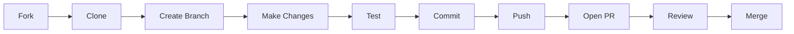

<div align="center">
  <h1>🤝 Contributing to CFP</h1>
  <p><strong>Crowdfunding Trading Platform</strong></p>
  <p>
    
    
  </p>
</div>

---

First off, **thank you** for taking the time to contribute! 🎉

We want to make contributing to this project as easy and transparent as possible, whether it's:

- 🐛 Reporting a bug
- 💬 Discussing the current state of the code
- 🔧 Submitting a fix
- ✨ Proposing new features
- 📖 Improving documentation

---

## 📋 Table of Contents

- [📜 Code of Conduct](#-code-of-conduct)
- [🚀 Getting Started](#-getting-started)
- [🔄 Development Workflow](#-development-workflow)
- [📝 Commit Messages](#-commit-messages)
- [🐍 Backend Guidelines (Django)](#-backend-guidelines-django)
- [⚛️ Frontend Guidelines (React)](#️-frontend-guidelines-react)
- [🔀 Pull Request Process](#-pull-request-process)
- [🐛 Reporting Issues](#-reporting-issues)
- [💡 Feature Requests](#-feature-requests)
- [📖 Documentation](#-documentation)
- [🏆 Recognition](#-recognition)
- [👨‍💻 Project Maintainer](#-project-maintainer)

---

## 📜 Code of Conduct

This project and everyone participating in it is governed by the [Contributor Covenant Code of Conduct](https://www.contributor-covenant.org/version/2/1/code-of-conduct). By participating, you are expected to uphold this code.

**In summary:**
- 🤝 Be respectful and inclusive
- 💬 Use welcoming and inclusive language
- 🎯 Focus on what is best for the community
- 🙏 Show empathy towards other community members

---

## 🚀 Getting Started

### Prerequisites

Before you begin, ensure you have:

| Tool | Version | Purpose |
|------|---------|---------|
| Git | Latest | Version control |
| Python | 3.10+ | Backend development |
| Node.js | 18+ LTS | Frontend development |
| PostgreSQL | 14+ | Database |

### Fork & Clone

1. **Fork the repository** on GitHub

2. **Clone your fork** locally:
   ```bash
   git clone https://github.com/YOUR-USERNAME/CFP-MVP.git
   cd CFP-MVP
   ```

3. **Add upstream remote**:
   ```bash
   git remote add upstream https://github.com/jiaamasum/CFP-MVP.git
   ```

4. **Set up the development environment**:
   
   **Backend:**
   ```bash
   cd backend
   python3 -m venv venv
   source venv/bin/activate
   pip install -r requirements.txt
   cp .env.example .env
   python manage.py migrate
   ```
   
   **Frontend:**
   ```bash
   cd frontend
   npm install
   cp .env.example .env.local
   ```

---

## 🔄 Development Workflow

### Branch Naming Convention

Create a branch for your work using the pattern `type/short-description`:

| Type | Description | Example |
|------|-------------|---------|
| `feat` | New feature | `feat/user-profile-edit` |
| `fix` | Bug fix | `fix/auth-token-refresh` |
| `docs` | Documentation | `docs/api-endpoints` |
| `style` | Code style/formatting | `style/lint-fixes` |
| `refactor` | Code refactoring | `refactor/auth-module` |
| `test` | Tests | `test/investment-api` |
| `chore` | Maintenance | `chore/update-deps` |

### Workflow Steps



1. **Sync with upstream** before starting:
   ```bash
   git fetch upstream
   git checkout main
   git merge upstream/main
   ```

2. **Create a feature branch**:
   ```bash
   git checkout -b feat/your-feature-name
   ```

3. **Make your changes** with proper commits

4. **Push to your fork**:
   ```bash
   git push origin feat/your-feature-name
   ```

5. **Open a Pull Request** on GitHub

---

## 📝 Commit Messages

We follow the **[Conventional Commits](https://www.conventionalcommits.org/)** specification for readable and standardized commit history.

### Format

```
<type>(<scope>): <subject>

[optional body]

[optional footer]
```

### Types

| Type | Description | Example |
|------|-------------|---------|
| `feat` | New feature | `feat(auth): add google oauth login` |
| `fix` | Bug fix | `fix(api): resolve token expiry issue` |
| `docs` | Documentation | `docs(readme): update installation steps` |
| `style` | Formatting (no code change) | `style(users): fix indentation` |
| `refactor` | Code refactoring | `refactor(investments): simplify logic` |
| `perf` | Performance improvement | `perf(queries): optimize db calls` |
| `test` | Adding/fixing tests | `test(projects): add creation tests` |
| `chore` | Maintenance tasks | `chore(deps): update dependencies` |
| `ci` | CI/CD changes | `ci(github): add test workflow` |

### Examples

```bash
# Feature
feat(projects): add 3D model preview support

# Bug fix
fix(wallet): correct balance calculation on withdrawal

# Documentation
docs(api): document investment endpoints

# With body
feat(auth): implement password reset flow

Added email-based password reset with:
- Reset token generation
- Email sending via SendGrid
- Token validation endpoint

Closes #42
```

---

## 🐍 Backend Guidelines (Django)

Our backend is built with **Django** and **Django REST Framework**. We maintain high standards for code quality and testing.

### Tooling Stack

| Tool | Purpose | Command |
|------|---------|---------|
| **[Black](https://github.com/psf/black)** | Code formatting | `black .` |
| **[isort](https://github.com/PyCQA/isort)** | Import sorting | `isort .` |
| **[Flake8](https://github.com/PyCQA/flake8)** | Linting (PEP8) | `flake8` |
| **[Mypy](https://mypy-lang.org/)** | Type checking | `mypy .` |
| **[Pytest](https://docs.pytest.org/)** | Testing | `pytest` |

### Pre-commit Checklist

Before pushing your code, run from the `backend/` directory:

```bash
# 1. Activate virtual environment
source venv/bin/activate

# 2. Format code
black .
isort .

# 3. Linting
flake8

# 4. Type checking (optional but recommended)
mypy .

# 5. Run tests
pytest

# 6. Check coverage (optional)
pytest --cov=. --cov-report=html
```

### Code Style Guidelines

```python
# ✅ Good: Clear, typed, documented
from rest_framework import serializers

class ProjectSerializer(serializers.ModelSerializer):
    """Serializer for Project model."""
    
    class Meta:
        model = Project
        fields = ['id', 'title', 'description', 'status']
    
    def validate_title(self, value: str) -> str:
        """Validate project title is not empty."""
        if not value.strip():
            raise serializers.ValidationError("Title cannot be empty")
        return value

# ❌ Bad: No types, no docstrings, unclear naming
class PS(serializers.ModelSerializer):
    class Meta:
        model = Project
        fields = '__all__'
```

### Testing Guidelines

```python
# tests/test_projects.py
import pytest
from django.urls import reverse
from rest_framework import status

@pytest.mark.django_db
class TestProjectAPI:
    """Test cases for Project API endpoints."""
    
    def test_create_project_success(self, api_client, developer_user):
        """Test successful project creation by developer."""
        api_client.force_authenticate(user=developer_user)
        
        response = api_client.post(
            reverse('project-list'),
            data={'title': 'Test Project', 'description': 'Description'}
        )
        
        assert response.status_code == status.HTTP_201_CREATED
        assert response.data['title'] == 'Test Project'
```

---

## ⚛️ Frontend Guidelines (React)

Our frontend is a modern **React** application using **Vite**, **TypeScript**, and **Tailwind CSS**.

### Tooling Stack

| Tool | Purpose | Command |
|------|---------|---------|
| **[ESLint](https://eslint.org/)** | Code linting | `npm run lint` |
| **[Prettier](https://prettier.io/)** | Code formatting | `npm run format` |
| **[TypeScript](https://www.typescriptlang.org/)** | Type checking | `npm run type-check` |
| **[Vitest](https://vitest.dev/)** | Unit testing | `npm run test` |

### Pre-commit Checklist

Before pushing your code, run from the `frontend/` directory:

```bash
# 1. Lint code
npm run lint

# 2. Fix lint issues automatically
npm run lint:fix

# 3. Format code
npm run format

# 4. Type check
npm run type-check

# 5. Run tests
npm run test

# 6. Verify build
npm run build
```

### Component Guidelines

```tsx
// ✅ Good: Typed props, clear structure, proper naming
import { FC } from 'react';
import { Button } from '@/components/ui/button';
import { Card, CardHeader, CardTitle, CardContent } from '@/components/ui/card';

interface ProjectCardProps {
  id: string;
  title: string;
  description: string;
  onInvest: (id: string) => void;
}

export const ProjectCard: FC<ProjectCardProps> = ({
  id,
  title,
  description,
  onInvest,
}) => {
  return (
    <Card className="hover:shadow-lg transition-shadow">
      <CardHeader>
        <CardTitle>{title}</CardTitle>
      </CardHeader>
      <CardContent>
        <p className="text-muted-foreground">{description}</p>
        <Button onClick={() => onInvest(id)} className="mt-4">
          Invest Now
        </Button>
      </CardContent>
    </Card>
  );
};

// ❌ Bad: No types, inline styles, unclear structure
export default function Card(props) {
  return (
    <div style={{padding: '20px'}}>
      <h2>{props.t}</h2>
      <p>{props.d}</p>
      <button onClick={props.f}>Click</button>
    </div>
  )
}
```

### File Structure

```
src/
├── components/
│   ├── common/          # Shared components
│   ├── layouts/         # Layout components
│   ├── ui/              # shadcn/ui components
│   └── [feature]/       # Feature-specific components
├── hooks/               # Custom hooks
├── lib/                 # Utilities
├── pages/               # Route pages
└── store/               # State management
```

---

## 🔀 Pull Request Process

### Before Opening a PR

- [ ] Code follows the style guidelines
- [ ] Self-review completed
- [ ] Tests added/updated
- [ ] Documentation updated (if needed)
- [ ] All checks pass locally

### PR Title Format

Use the same format as commit messages:

```
feat(projects): add project comparison feature
fix(auth): resolve token refresh loop
docs(api): add investment endpoint documentation
```

### PR Template

```markdown
## Description
Brief description of what this PR does.

## Type of Change
- [ ] Bug fix (non-breaking change fixing an issue)
- [ ] New feature (non-breaking change adding functionality)
- [ ] Breaking change (fix or feature causing existing functionality to change)
- [ ] Documentation update

## How Has This Been Tested?
Describe the tests you ran.

## Checklist
- [ ] My code follows the project style guidelines
- [ ] I have performed a self-review
- [ ] I have added tests that prove my fix/feature works
- [ ] New and existing unit tests pass locally
- [ ] Any dependent changes have been merged

## Screenshots (if applicable)
Add screenshots for UI changes.
```

### Review Process

1. **Draft PRs**: Open a Draft PR early if you want feedback
2. **Reviewers**: Request review from maintainers
3. **CI Checks**: All automated checks must pass
4. **Approval**: At least one approval from a maintainer required
5. **Merge**: Maintainer will merge after approval

---

## 🐛 Reporting Issues

Found a bug? [Open an issue](https://github.com/jiaamasum/CFP-MVP/issues/new?template=bug_report.md)!

### Great Bug Reports Include

| Element | Description |
|---------|-------------|
| **Summary** | Clear, concise description |
| **Steps** | Specific steps to reproduce |
| **Expected** | What you expected to happen |
| **Actual** | What actually happened |
| **Environment** | OS, browser, versions |
| **Screenshots** | Visual evidence (if applicable) |
| **Logs** | Error messages or console output |

### Example Bug Report

```markdown
## Bug Description
Investment total shows incorrect amount after purchase.

## Steps to Reproduce
1. Login as investor
2. Navigate to project "Test Project"
3. Purchase 10 shares at $100 each
4. Check portfolio total

## Expected Behavior
Portfolio total should increase by $1,000.

## Actual Behavior
Portfolio total increases by $100 (only one share counted).

## Environment
- OS: macOS Ventura 14.0
- Browser: Chrome 120
- Frontend: v1.0.0
- Backend: v1.0.0

## Screenshots
[Attach screenshot of portfolio page]

## Console Errors
```
Error: Investment calculation failed at line 42
```
```

---

## 💡 Feature Requests

Have an idea? [Open a feature request](https://github.com/jiaamasum/CFP-MVP/issues/new?template=feature_request.md)!

### Feature Request Template

```markdown
## Feature Description
Clear description of the feature.

## Problem It Solves
What problem does this solve?

## Proposed Solution
How do you envision this working?

## Alternatives Considered
Other approaches you've thought about.

## Additional Context
Mockups, examples, or references.
```

---

## 📖 Documentation

Documentation improvements are always welcome!

### Types of Documentation

| Type | Location | Description |
|------|----------|-------------|
| **README** | `README.md`, `*/README.md` | Project overview and setup |
| **User Manual** | `USER_MANUAL.md` | End-user documentation |
| **API Docs** | Auto-generated | OpenAPI/Swagger docs |
| **Code Comments** | In source files | Inline documentation |
| **Contributing** | `CONTRIBUTING.md` | This file |

### Documentation Style

- Use clear, concise language
- Include code examples where helpful
- Add screenshots for UI-related docs
- Keep formatting consistent with existing docs

---

## 🏆 Recognition

Contributors are recognized in:

- **GitHub Contributors** page
- **Release notes** (for significant contributions)
- **README** acknowledgments (for major features)

---

## 👨‍💻 Project Maintainer

<div align="center">
  <table>
    <tr>
      <td align="center">
        <a href="https://github.com/jiaamasum">
          
          <br />
          <sub><b>Masum Jia</b></sub>
        </a>
        <br />
        <sub>Project Creator & Lead Maintainer</sub>
        <br />
        <a href="https://github.com/jiaamasum">
          
        </a>
      </td>
    </tr>
  </table>
</div>

### Contact

- **GitHub**: [@jiaamasum](https://github.com/jiaamasum)
- **Issues**: [GitHub Issues](https://github.com/jiaamasum/CFP-MVP/issues)

---

<div align="center">
  <p>
    <sub>Thank you for contributing to CFP! 🙏</sub>
  </p>
  <p>
    <a href="README.md">🏠 Back to Main</a> •
    <a href="frontend/README.md">🎨 Frontend</a> •
    <a href="backend/README.md">⚙️ Backend</a>
  </p>
</div>
