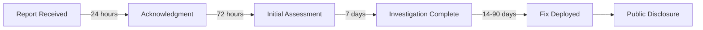

<div align="center">
  <h1>🔒 Security Policy</h1>
  <p><strong>Crowdfunding Trading Platform (CFP)</strong></p>
  <p>
    
    
  </p>
</div>

---

## 📋 Table of Contents

- [🎯 Our Commitment](#-our-commitment)
- [📦 Supported Versions](#-supported-versions)
- [🔐 Security Features](#-security-features)
- [🚨 Reporting a Vulnerability](#-reporting-a-vulnerability)
- [⏱️ Response Timeline](#️-response-timeline)
- [🔍 Vulnerability Assessment](#-vulnerability-assessment)
- [🛡️ Security Best Practices](#️-security-best-practices)
- [🔑 Authentication & Authorization](#-authentication--authorization)
- [💾 Data Protection](#-data-protection)
- [🌐 API Security](#-api-security)
- [🏗️ Infrastructure Security](#️-infrastructure-security)
- [📝 Security Changelog](#-security-changelog)
- [🙏 Acknowledgments](#-acknowledgments)
- [📧 Contact](#-contact)

---

## 🎯 Our Commitment

The security of the Crowdfunding Trading Platform (CFP) is a top priority. We are committed to:

| Commitment | Description |
|------------|-------------|
| 🔍 **Proactive Security** | Continuously monitoring and improving our security posture |
| 🚀 **Rapid Response** | Quickly addressing reported vulnerabilities |
| 🤝 **Transparency** | Communicating openly about security issues and fixes |
| 🏆 **Recognition** | Acknowledging security researchers who help us improve |
| 📚 **Education** | Helping our community understand security best practices |

We take all security reports seriously and appreciate the security research community's efforts in helping us maintain a secure platform.

---

## 📦 Supported Versions

We provide security updates for the following versions:

| Version | Status | Support Level | End of Support |
|---------|--------|---------------|----------------|
| 3.x (Current) | ✅ Active | Full security support | TBD |
| 2.x | ⚠️ Maintenance | Critical security fixes only | 2026-06-01 |
| 1.x | ❌ End of Life | No security updates | 2025-12-31 |
| < 1.0 | ❌ End of Life | No security updates | N/A |

### Version Support Details

- **Active**: Receives all security patches, bug fixes, and new features
- **Maintenance**: Receives only critical and high-severity security patches
- **End of Life**: No longer receiving any updates; upgrade immediately

> ⚠️ **Important**: We strongly recommend always running the latest version to ensure you have the most up-to-date security patches.

---

## 🔐 Security Features

### Authentication

| Feature | Implementation | Status |
|---------|----------------|--------|
| JWT Authentication | SimpleJWT with RS256 | ✅ Implemented |
| Token Expiration | Access: 15min, Refresh: 7 days | ✅ Implemented |
| Password Hashing | PBKDF2 with SHA256 | ✅ Implemented |
| Password Requirements | Min 8 chars, uppercase, lowercase, number, special | ✅ Implemented |
| Account Lockout | 5 failed attempts = 15min lockout | ✅ Implemented |
| Session Management | Single session per device | ✅ Implemented |
| Google OAuth | OAuth 2.0 with PKCE | ✅ Implemented |

### Authorization

| Feature | Implementation | Status |
|---------|----------------|--------|
| Role-Based Access Control (RBAC) | Admin, Developer, Investor roles | ✅ Implemented |
| Permission-Based Access | Granular permissions per endpoint | ✅ Implemented |
| Resource Ownership | Users can only access own resources | ✅ Implemented |
| Admin Approval Workflows | Projects, investments require approval | ✅ Implemented |

### Data Protection

| Feature | Implementation | Status |
|---------|----------------|--------|
| HTTPS/TLS | TLS 1.3 minimum | ✅ Implemented |
| Data Encryption at Rest | AES-256 | ✅ Implemented |
| Data Encryption in Transit | TLS 1.3 | ✅ Implemented |
| PII Protection | Masked in logs, encrypted storage | ✅ Implemented |
| Secure File Upload | Type validation, size limits | ✅ Implemented |

### API Security

| Feature | Implementation | Status |
|---------|----------------|--------|
| CORS Configuration | Whitelist-based origins | ✅ Implemented |
| Rate Limiting | 100 req/min authenticated, 20 req/min anonymous | ✅ Implemented |
| Input Validation | Serializer-based validation | ✅ Implemented |
| SQL Injection Prevention | Django ORM parameterized queries | ✅ Implemented |
| XSS Prevention | Content Security Policy, output encoding | ✅ Implemented |
| CSRF Protection | Token-based for session auth | ✅ Implemented |

---

## 🚨 Reporting a Vulnerability

We appreciate responsible disclosure of security vulnerabilities. If you discover a security issue, please follow these steps:

### 📧 How to Report

**DO NOT** report security vulnerabilities through public GitHub issues.

Instead, please report them through one of these channels:

| Method | Details |
|--------|---------|
| **GitHub Security Advisories** | [Report a vulnerability](https://github.com/jiaamasum/CFP-MVP/security/advisories/new) |
| **Direct Contact** | [@jiaamasum](https://github.com/jiaamasum) on GitHub |

### 📝 What to Include

Please provide as much information as possible to help us understand and reproduce the issue:

```markdown
## Vulnerability Report

### Summary
Brief description of the vulnerability

### Affected Component
- [ ] Frontend (React/Vite)
- [ ] Backend (Django REST)
- [ ] Authentication
- [ ] Database
- [ ] API Endpoints
- [ ] File Storage
- [ ] Other: ___________

### Severity Assessment
- [ ] Critical - System compromise, data breach
- [ ] High - Significant security impact
- [ ] Medium - Limited security impact
- [ ] Low - Minimal security impact

### Description
Detailed description of the vulnerability

### Steps to Reproduce
1. Step one
2. Step two
3. Step three

### Proof of Concept
Code, screenshots, or video demonstrating the vulnerability

### Impact
What could an attacker achieve by exploiting this?

### Suggested Fix (Optional)
Your recommendation for fixing the issue

### Environment
- OS: 
- Browser (if applicable):
- Version affected:
```

### ✅ Do's and Don'ts

| ✅ Do | ❌ Don't |
|-------|---------|
| Report vulnerabilities responsibly | Publicly disclose before we can fix |
| Provide detailed reproduction steps | Access data beyond what's needed to demonstrate |
| Give us reasonable time to respond | Exploit the vulnerability maliciously |
| Keep findings confidential | Share findings with others before disclosure |
| Test against your own accounts | Test against other users' accounts |

---

## ⏱️ Response Timeline

We are committed to responding to security reports promptly:



### Detailed Timeline

| Phase | Timeframe | Description |
|-------|-----------|-------------|
| **Acknowledgment** | Within 24 hours | We confirm receipt of your report |
| **Initial Assessment** | Within 72 hours | We assess severity and validity |
| **Status Update** | Every 7 days | We provide progress updates |
| **Fix Development** | 14-90 days | Depending on severity and complexity |
| **Fix Deployment** | ASAP after testing | Deployed to all supported versions |
| **Public Disclosure** | After fix is deployed | Coordinated disclosure with reporter |

### Severity-Based Response

| Severity | Initial Response | Fix Timeline |
|----------|------------------|--------------|
| 🔴 **Critical** | 4 hours | 24-72 hours |
| 🟠 **High** | 24 hours | 7-14 days |
| 🟡 **Medium** | 48 hours | 30 days |
| 🟢 **Low** | 72 hours | 90 days |

---

## 🔍 Vulnerability Assessment

We use the Common Vulnerability Scoring System (CVSS) v3.1 to assess vulnerabilities:

### Severity Levels

| Level | CVSS Score | Description | Example |
|-------|------------|-------------|---------|
| 🔴 **Critical** | 9.0 - 10.0 | Immediate threat, full system compromise | Remote code execution, auth bypass |
| 🟠 **High** | 7.0 - 8.9 | Significant impact, major data exposure | SQL injection, privilege escalation |
| 🟡 **Medium** | 4.0 - 6.9 | Limited impact, partial data exposure | XSS, CSRF, info disclosure |
| 🟢 **Low** | 0.1 - 3.9 | Minimal impact, hardening issues | Missing headers, verbose errors |

### Assessment Criteria

| Factor | Considerations |
|--------|----------------|
| **Attack Vector** | Network, Adjacent, Local, Physical |
| **Attack Complexity** | Low, High |
| **Privileges Required** | None, Low, High |
| **User Interaction** | None, Required |
| **Scope** | Unchanged, Changed |
| **Confidentiality Impact** | None, Low, High |
| **Integrity Impact** | None, Low, High |
| **Availability Impact** | None, Low, High |

---

## 🛡️ Security Best Practices

### For Users

| Practice | Description |
|----------|-------------|
| 🔐 **Strong Passwords** | Use unique, complex passwords (min 12 characters) |
| 🔄 **Regular Updates** | Keep your browser and dependencies updated |
| 🚫 **Phishing Awareness** | Never share credentials via email or messages |
| 🔍 **URL Verification** | Always verify you're on the legitimate platform |
| 🚪 **Logout** | Always logout when using shared devices |
| 📱 **Secure Devices** | Use device encryption and screen locks |

### For Developers

| Practice | Description |
|----------|-------------|
| 🔑 **Environment Variables** | Never commit secrets to version control |
| 📦 **Dependency Updates** | Regularly update and audit dependencies |
| 🧪 **Security Testing** | Include security tests in CI/CD pipeline |
| 📝 **Code Review** | Review all code for security implications |
| 🔒 **Least Privilege** | Grant minimum necessary permissions |
| 📊 **Logging** | Log security events without sensitive data |

### For Administrators

| Practice | Description |
|----------|-------------|
| 🔐 **Access Control** | Implement principle of least privilege |
| 📋 **Audit Logs** | Regularly review audit logs for anomalies |
| 🔄 **Backup** | Maintain encrypted, tested backups |
| 🚨 **Monitoring** | Set up alerts for suspicious activities |
| 📚 **Training** | Keep team updated on security practices |
| 🧪 **Penetration Testing** | Conduct regular security assessments |

---

## 🔑 Authentication & Authorization

### Password Policy

```
Minimum Requirements:
├── Length: 8+ characters (12+ recommended)
├── Uppercase: At least 1 (A-Z)
├── Lowercase: At least 1 (a-z)
├── Numbers: At least 1 (0-9)
├── Special: At least 1 (!@#$%^&*...)
└── Not in common password lists
```

### JWT Token Structure

| Token | Expiration | Purpose |
|-------|------------|---------|
| Access Token | 15 minutes | API authentication |
| Refresh Token | 7 days | Obtain new access tokens |

### Role Permissions

| Permission | Admin | Developer | Investor |
|------------|:-----:|:---------:|:--------:|
| View all users | ✅ | ❌ | ❌ |
| Manage users | ✅ | ❌ | ❌ |
| Approve projects | ✅ | ❌ | ❌ |
| Create projects | ❌ | ✅ | ❌ |
| Edit own projects | ❌ | ✅ | ❌ |
| Make investments | ❌ | ❌ | ✅ |
| View own portfolio | ❌ | ❌ | ✅ |
| View audit logs | ✅ | ❌ | ❌ |
| Manage access requests | ✅ | ✅ | ❌ |

---

## 💾 Data Protection

### Data Classification

| Classification | Examples | Protection Level |
|----------------|----------|------------------|
| 🔴 **Confidential** | Passwords, tokens, payment info | Encrypted, access-controlled, audited |
| 🟠 **Private** | Email, phone, address | Encrypted, need-to-know access |
| 🟡 **Internal** | Project details, investment amounts | Access-controlled by role |
| 🟢 **Public** | Public project info, platform stats | No restrictions |

### Data Handling

| Data Type | Storage | Retention | Deletion |
|-----------|---------|-----------|----------|
| User credentials | Hashed (PBKDF2) | Account lifetime | On account deletion |
| Personal info | Encrypted (AES-256) | Account lifetime | On request or deletion |
| Session tokens | Memory/Redis | 7 days max | On logout or expiry |
| Audit logs | Encrypted | 2 years | After retention period |
| Investment records | Encrypted | 7 years (legal) | After retention period |

### GDPR Compliance

| Right | Implementation |
|-------|----------------|
| Right to Access | Export personal data via profile |
| Right to Rectification | Edit profile information |
| Right to Erasure | Account deletion request |
| Right to Portability | Data export in standard formats |
| Right to Object | Unsubscribe from communications |

---

## 🌐 API Security

### Rate Limiting

| Endpoint Type | Authenticated | Anonymous |
|---------------|---------------|-----------|
| General API | 100 req/min | 20 req/min |
| Authentication | 10 req/min | 5 req/min |
| File Upload | 10 req/min | N/A |
| Password Reset | 3 req/hour | 3 req/hour |

### Security Headers

```http
# Implemented Security Headers
Content-Security-Policy: default-src 'self'; script-src 'self' 'unsafe-inline'
X-Content-Type-Options: nosniff
X-Frame-Options: DENY
X-XSS-Protection: 1; mode=block
Strict-Transport-Security: max-age=31536000; includeSubDomains
Referrer-Policy: strict-origin-when-cross-origin
Permissions-Policy: geolocation=(), microphone=(), camera=()
```

### Input Validation

| Input Type | Validation |
|------------|------------|
| Email | RFC 5322 format, domain verification |
| Password | Complexity rules, breach database check |
| File Upload | MIME type, extension, size, content scan |
| Text Input | Length limits, HTML sanitization |
| Numeric | Range validation, type checking |
| URLs | Whitelist validation, protocol check |

---

## 🏗️ Infrastructure Security

### Architecture Security

```
┌─────────────────────────────────────────────────────────────┐
│                        CDN / WAF                            │
│                    (DDoS Protection)                        │
└─────────────────────────────────────────────────────────────┘
                              │
                              ▼
┌─────────────────────────────────────────────────────────────┐
│                    Load Balancer                            │
│                   (SSL Termination)                         │
└─────────────────────────────────────────────────────────────┘
                              │
              ┌───────────────┴───────────────┐
              ▼                               ▼
┌──────────────────────┐        ┌──────────────────────┐
│   Frontend (React)   │        │   Backend (Django)   │
│   Static Hosting     │        │   Application Server │
└──────────────────────┘        └──────────────────────┘
                                          │
                              ┌───────────┴───────────┐
                              ▼                       ▼
                    ┌──────────────┐        ┌──────────────┐
                    │  PostgreSQL  │        │   Supabase   │
                    │   Database   │        │   Storage    │
                    └──────────────┘        └──────────────┘
```

### Environment Security

| Environment | Security Measures |
|-------------|-------------------|
| **Development** | Local only, no real data, DEBUG=True allowed |
| **Staging** | VPN access, sanitized data, DEBUG=False |
| **Production** | Full security controls, real data, monitoring |

### Secrets Management

| Secret Type | Storage Method |
|-------------|----------------|
| API Keys | Environment variables |
| Database Credentials | Environment variables |
| JWT Secret | Environment variables |
| Supabase Keys | Environment variables |

> ⚠️ **Never commit secrets to version control**

---

## 📝 Security Changelog

| Date | Version | Type | Description |
|------|---------|------|-------------|
| 2026-01-09 | 3.0 | Enhancement | Initial security policy documentation |
| 2026-01-09 | 3.0 | Enhancement | Comprehensive security features audit |

---

## 🙏 Acknowledgments

We thank the following security researchers for their responsible disclosure:

| Researcher | Contribution | Date |
|------------|--------------|------|
| *Your name here* | *Be the first!* | - |

### Hall of Fame

We maintain a security hall of fame to recognize those who have helped improve our security. To be added, report a valid security vulnerability following our responsible disclosure process.

---

## 📧 Contact

### Security Team

| Contact | Details |
|---------|---------|
| **Project Maintainer** | Masum Jia |
| **GitHub** | [@jiaamasum](https://github.com/jiaamasum) |
| **Security Advisories** | [GitHub Security](https://github.com/jiaamasum/CFP-MVP/security) |

### Response Commitment

- 📬 All reports acknowledged within 24 hours
- 🔍 Initial assessment within 72 hours
- 📊 Regular updates every 7 days
- 🚀 Rapid fixes for critical issues

---

## 📜 Policy Updates

This security policy may be updated periodically. Major changes will be announced through:

- GitHub release notes
- Repository announcements
- Direct notification to known reporters

**Last Updated**: January 9, 2026  
**Version**: 1.0  
**Author**: [Masum Jia](https://github.com/jiaamasum)

---

<div align="center">
  <p>
    <sub>Security is everyone's responsibility. Thank you for helping keep CFP secure.</sub>
  </p>
  <p>
    <a href="README.md">🏠 Back to Main</a> •
    <a href="CONTRIBUTING.md">🤝 Contributing</a> •
    <a href="CODE_OF_CONDUCT.md">📜 Code of Conduct</a>
  </p>
  <p>
    <sub>Maintained by <a href="https://github.com/jiaamasum">Masum Jia</a></sub>
  </p>
</div>
