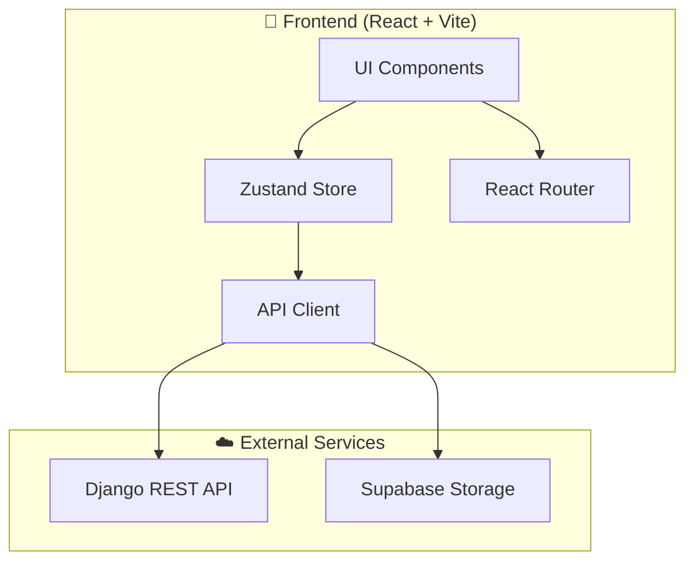

<div align="center">
  

  <h1>🎨 CFP Frontend</h1>

  <p>
    <strong>Modern React + Vite interface for role-based crowdfunding, investments, and project management.</strong>
  </p>

  <p>
    <a href="../README.md"><strong>📖 About Project</strong></a> •
    <a href="../backend/README.md"><strong>⚙️ Backend</strong></a> •
    <a href="#-quick-start"><strong>🚀 Quick Start</strong></a> •
    <a href="../CONTRIBUTING.md"><strong>🤝 Contributing</strong></a>
  </p>

  <p>
    
    
    
    
  </p>

  <p>
    
    
    
    
  </p>
</div>

---

## 📋 Table of Contents

- [✨ Features](#-features)
- [📸 Screenshots](#-screenshots)
- [🏗️ Architecture](#️-architecture)
- [📁 Project Structure](#-project-structure)
- [🚀 Quick Start](#-quick-start)
- [⚙️ Configuration](#️-configuration)
- [🎨 UI Components](#-ui-components)
- [🔐 Authentication](#-authentication)
- [📱 Role-Based Layouts](#-role-based-layouts)
- [🛠️ Development](#️-development)
- [🧪 Testing](#-testing)
- [📦 Building](#-building)
- [❓ Troubleshooting](#-troubleshooting)
- [👨‍💻 Author](#-author)

---

## ✨ Features

### 🌐 Public Features
| Feature | Description |
|---------|-------------|
| 🏠 Landing Page | Hero section with featured projects and platform statistics |
| 🔐 Authentication | Login/Register with email or Google OAuth |
| 📋 Project Browsing | Browse approved public projects with search and filters |
| 🌙 Dark Mode | System-aware theme with manual toggle |

### 💼 Investor Features
| Feature | Description |
|---------|-------------|
| 📊 Dashboard | Portfolio overview, recent investments, ROI tracking |
| 💰 Wallet | Balance management, transaction history, deposits |
| 🛒 Investment Flow | Multi-step share purchase with confirmation |
| ⚖️ Compare Tool | Side-by-side comparison of up to 4 projects |
| ❤️ Favorites | Save and organize interesting projects |
| 🔓 Access Requests | Request access to restricted project content |

### 👨‍💻 Developer Features
| Feature | Description |
|---------|-------------|
| 📈 Dashboard | Project analytics, funding progress, investor count |
| ➕ Project Creation | Multi-step wizard with media uploads |
| 📝 Project Management | Edit, archive, track submissions |
| 🎮 3D Model Viewer | Interactive GLB/GLTF model preview |
| 📧 Investor Communication | Respond to access requests |

### 👑 Admin Features
| Feature | Description |
|---------|-------------|
| 🎛️ Dashboard | Platform-wide statistics and activity |
| ✅ Review Queue | Approve/reject project submissions |
| 🔐 Access Requests | Manage content access approvals |
| 💳 Investment Requests | Process investment transactions |
| 👥 User Management | View, verify, manage all users |
| 📋 Audit Logs | Track all system activities |

---

## 📸 Screenshots

<details>
<summary><strong>Click to expand screenshots</strong></summary>

| Landing Page | Login |
|:---:|:---:|
|  |  |

| Investor Dashboard | Admin Dashboard |
|:---:|:---:|
|  |  |

| Developer Dashboard | Dark Mode |
|:---:|:---:|
|  |  |

</details>

---

## 🏗️ Architecture



### Technology Stack

| Category | Technology | Purpose |
|----------|------------|---------|
| **Framework** | React 18 | UI library with hooks |
| **Bundler** | Vite | Fast dev server & build |
| **Language** | TypeScript | Type-safe development |
| **Styling** | Tailwind CSS | Utility-first styling |
| **Components** | shadcn/ui | Accessible UI components |
| **State** | Zustand | Lightweight state management |
| **Forms** | React Hook Form + Zod | Form handling & validation |
| **Charts** | Recharts | Data visualization |
| **Icons** | Lucide React | Beautiful icons |
| **HTTP** | Axios | API communication |
| **3D** | @google/model-viewer | 3D model rendering |

---

## 📁 Project Structure

```
frontend/
├── public/                 # Static assets
├── src/
│   ├── components/         # Reusable UI components
│   │   ├── common/         # Shared components (Header, Footer, etc.)
│   │   ├── layouts/        # Role-based layout wrappers
│   │   ├── ui/             # shadcn/ui components
│   │   └── ...             # Feature-specific components
│   ├── hooks/              # Custom React hooks
│   ├── lib/                # Utilities and API clients
│   │   ├── api.ts          # Axios instance configuration
│   │   ├── utils.ts        # Helper functions
│   │   └── env.ts          # Environment configuration
│   ├── pages/              # Page components (routes)
│   │   ├── admin/          # Admin-only pages
│   │   ├── developer/      # Developer-only pages
│   │   ├── investor/       # Investor-only pages
│   │   └── ...             # Public pages
│   ├── store/              # Zustand stores
│   │   └── authStore.ts    # Authentication state
│   ├── App.tsx             # Main app with routing
│   └── main.tsx            # Entry point
├── .env.example            # Environment template
├── tailwind.config.ts      # Tailwind configuration
├── vite.config.ts          # Vite configuration
└── package.json            # Dependencies
```

---

## 🚀 Quick Start

### Prerequisites

- **Node.js** 18+ (LTS recommended)
- **npm** or **yarn** or **bun**
- Backend server running (see [backend README](../backend/README.md))

### Installation

```bash
# Navigate to frontend directory
cd frontend

# Install dependencies
npm install
# or
yarn install
# or
bun install

# Copy environment template
cp .env.example .env.local

# Start development server
npm run dev
```

The app will be available at **`http://localhost:8080`**

---

## ⚙️ Configuration

### Environment Variables

Create a `.env.local` file in the `frontend/` directory:

```bash
# API Configuration
VITE_API_URL=http://localhost:8000/api
VITE_API_BASE_URL=http://localhost:8000/api
VITE_FRONTEND_URL=http://localhost:8080

# Supabase Configuration
VITE_SUPABASE_URL=https://your-project.supabase.co
VITE_SUPABASE_ANON_KEY=your-supabase-anon-key
VITE_SUPABASE_PROJECT_ID=your-project-id

# OAuth (Optional)
VITE_GOOGLE_CLIENT_ID=your-google-client-id
```

| Variable | Required | Description |
|----------|:--------:|-------------|
| `VITE_API_URL` | ✅ | Backend API base URL |
| `VITE_API_BASE_URL` | ✅ | Backend API base URL (alias) |
| `VITE_FRONTEND_URL` | ✅ | Frontend public URL |
| `VITE_SUPABASE_URL` | ✅ | Supabase project URL |
| `VITE_SUPABASE_ANON_KEY` | ✅ | Supabase anonymous key |
| `VITE_SUPABASE_PROJECT_ID` | ✅ | Supabase project ID |
| `VITE_GOOGLE_CLIENT_ID` | ❌ | Google OAuth client ID |

---

## 🎨 UI Components

We use **shadcn/ui** for accessible, customizable components:

```bash
# Add a new component
npx shadcn-ui@latest add button
npx shadcn-ui@latest add card
npx shadcn-ui@latest add dialog
```

### Key Components Used

| Component | Usage |
|-----------|-------|
| `Button` | Actions, form submissions |
| `Card` | Project cards, dashboard stats |
| `Dialog` | Modals, confirmations |
| `Form` | Form handling with validation |
| `Table` | Data tables (investments, users) |
| `Tabs` | Tabbed navigation |
| `Toast` | Notifications |
| `Sidebar` | Dashboard navigation |

---

## 🔐 Authentication

Authentication is managed via **Zustand** store with JWT tokens:

```typescript
// src/store/authStore.ts
interface AuthState {
  user: User | null;
  token: string | null;
  isAuthenticated: boolean;
  login: (credentials) => Promise<void>;
  logout: () => void;
  register: (data) => Promise<void>;
}
```

### Protected Routes

Routes are protected based on user roles:

```tsx
// Example: Admin-only route
<Route path="/admin/*" element={
  <ProtectedRoute roles={['admin']}>
    <AdminLayout />
  </ProtectedRoute>
} />
```

---

## 📱 Role-Based Layouts

The app uses different layouts based on user roles:

| Layout | Role | Features |
|--------|------|----------|
| `PublicLayout` | Guest | Header, Footer |
| `InvestorLayout` | Investor | Sidebar, Portfolio nav |
| `DeveloperLayout` | Developer | Sidebar, Project tools |
| `AdminLayout` | Admin | Sidebar, Full system access |

Located in `src/components/layouts/`

---

## 🛠️ Development

### Available Scripts

```bash
# Development server with hot reload
npm run dev

# Type checking
npm run type-check

# Linting
npm run lint

# Format code
npm run format

# Build for production
npm run build

# Preview production build
npm run preview
```

### Code Style

- **ESLint** for code linting
- **Prettier** for code formatting
- **TypeScript** strict mode enabled

---

## 🧪 Testing

```bash
# Run tests
npm run test

# Run tests with coverage
npm run test:coverage

# Run tests in watch mode
npm run test:watch
```

---

## 📦 Building

```bash
# Create production build
npm run build

# Output will be in dist/ directory
# Preview the build
npm run preview
```

### Build Output

```
dist/
├── assets/          # Bundled JS, CSS
├── index.html       # Entry HTML
└── ...
```

---

## ❓ Troubleshooting

| Issue | Solution |
|-------|----------|
| **API Connection Failed** | Ensure backend is running on port 8000 |
| **CORS Error** | Verify `CORS_ALLOWED_ORIGINS` in backend includes `http://localhost:8080` |
| **Images Not Loading** | Check Supabase bucket permissions and URL configuration |
| **Auth Token Expired** | Log out and log back in; tokens are refreshed automatically |
| **Build Fails** | Run `npm run type-check` to identify TypeScript errors |
| **Hot Reload Not Working** | Restart dev server; check for syntax errors |

---

## 👨‍💻 Author

<div align="center">
  <table>
    <tr>
      <td align="center">
        <a href="https://github.com/jiaamasum">
          
          <br />
          <sub><b>Masum Jia</b></sub>
        </a>
        <br />
        <sub>Project Creator & Lead Developer</sub>
        <br />
        <a href="https://github.com/jiaamasum" title="GitHub">
          
        </a>
      </td>
    </tr>
  </table>
  
  <p><strong>Created and maintained by <a href="https://github.com/jiaamasum">Masum Jia</a></strong></p>
</div>

---

## 📄 License

This project is licensed under the MIT License - see the [LICENSE](../LICENSE) file for details.

---

<div align="center">
  <p>
    <sub>Built with ❤️ using React, Vite, TypeScript, and Tailwind CSS</sub>
  </p>
  <p>
    <a href="../README.md">🏠 Back to Main</a> •
    <a href="../backend/README.md">⚙️ Backend Docs</a> •
    <a href="../CONTRIBUTING.md">🤝 Contributing</a>
  </p>
</div>
