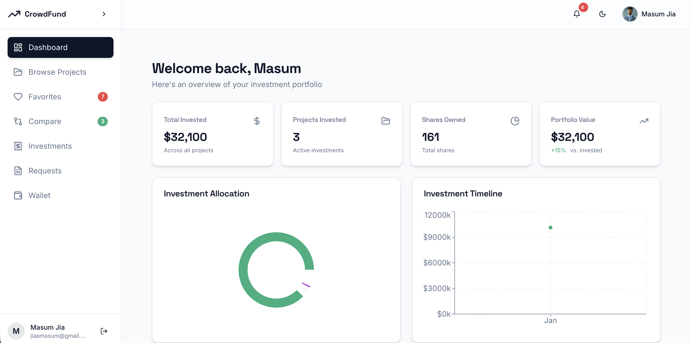
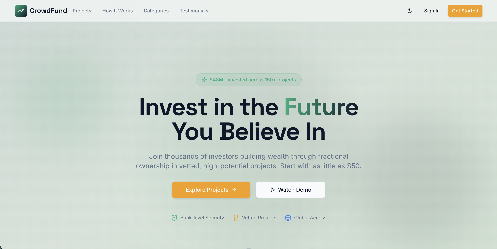
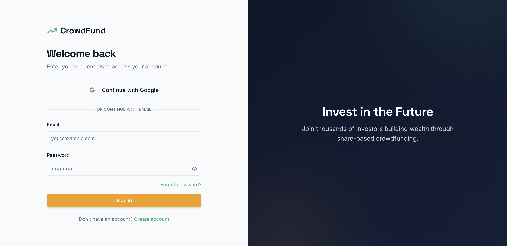
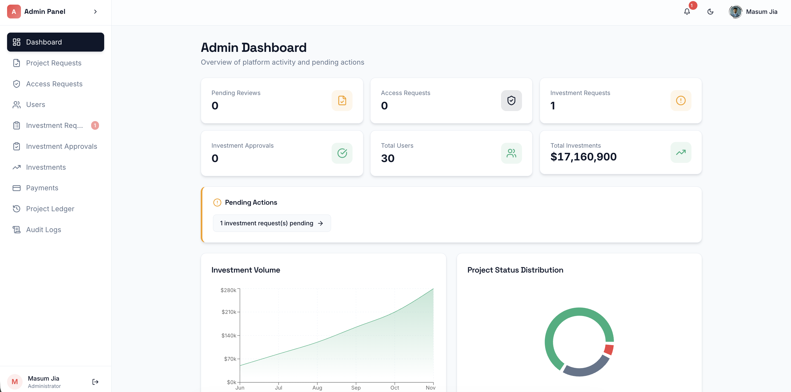
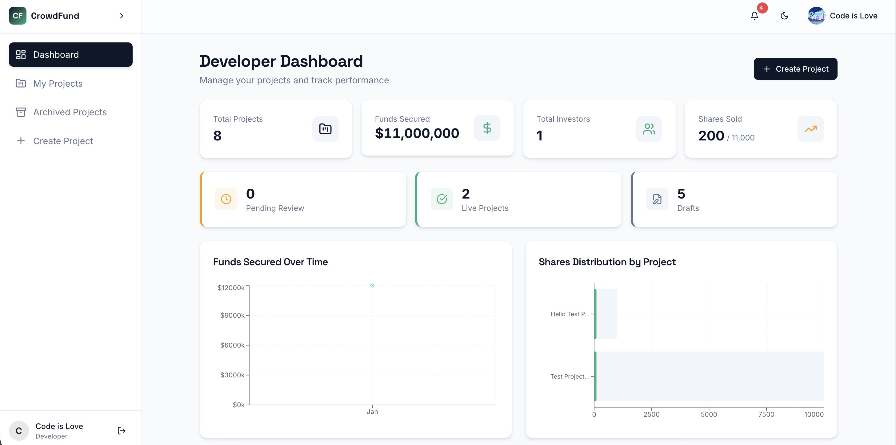
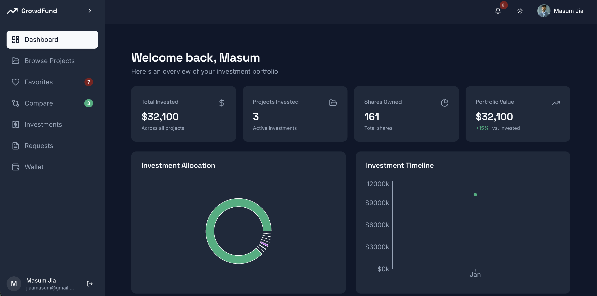
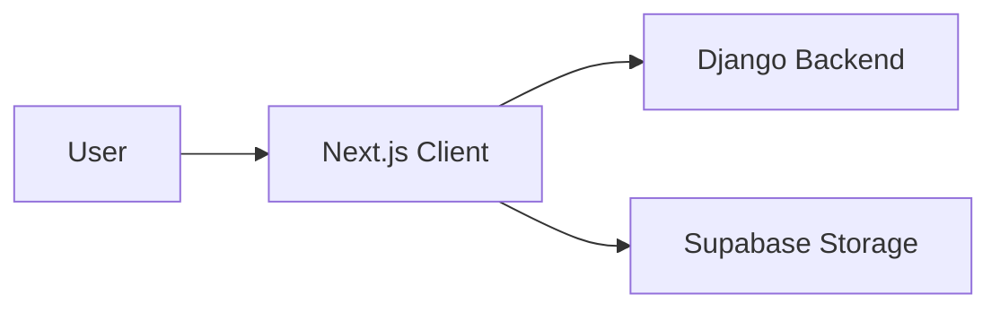

<p align="center">
  
</p>

<h1 align="center">CFP Frontend</h1>

<p align="center">
  Modern React/Next.js interface for role-based crowdfunding, investments, and project management.
</p>

<p align="center">
  <a href="../README.md">About Project</a> |
  <a href="../backend/README.md">Backend</a> |
  <a href="#local-setup">Run locally</a>
</p>

<p align="center">
  
  
  
</p>

---

## Table of Contents
- [Animated Preview](#animated-preview)
- [Screenshots](#screenshots)
- [System Overview](#system-overview)
- [Core Features](#core-features)
- [Layout System](#layout-system)
- [State Management](#state-management)
- [Requirements](#requirements)
- [Local Setup](#local-setup)
- [Environment Variables](#environment-variables)
- [Project Structure](#project-structure)
- [Troubleshooting](#troubleshooting)

## Animated Preview
Click the image to watch the walkthrough.

[](../docs/screenshots/project_overview.mov)

## Screenshots
| Landing Page | Login |
| --- | --- |
|  |  |

| Investor Dashboard | Admin Dashboard |
| --- | --- |
|  |  |

| Developer | Dark Mode |
| --- | --- |
|  |  |

## System Overview


## Core Features
### Public
- Landing page with featured projects.
- Authentication (Login/Register).
- Public project browsing (limited).

### Investor
- Dashboard with portfolio overview.
- Investment wallet and transactions.
- Project comparison tool.
- Favorites and detailed project views.

### Project Developer
- Dashboard with project stats.
- Create and edit project proposals.
- Manage media (images, 3D, video).
- Track funding progress.

### Admin
- Oversight dashboard.
- User management and verification.
- Investment and project approvals.
- System-wide audit logs.

## Layout System
The app uses role-based layouts in `src/components/layouts`:
- `PublicLayout`: for unauthenticated or public pages.
- `InvestorLayout`: includes sidebar and investor-specific nav.
- `DeveloperLayout`: includes developer tools and stats.
- `AdminLayout`: full system access controls.

## State Management
- **Zustand**: Used for authentication state (`authStore.ts`).
- **React Context**: Used for theme handling (`ThemeProvider`).
- **React Query** (optional/recommended): for API data fetching caching.

## Requirements
- Node.js 18+
- npm or yarn

## Local Setup
```bash
cd frontend
npm install
npm run dev
```

App runs at `http://localhost:8080`.

## Environment Variables
Configure these in `frontend/.env.local`:

| Variable | Purpose |
| --- | --- |
| VITE_API_URL | Backend API base URL |
| VITE_SUPABASE_URL | Supabase project URL |
| VITE_SUPABASE_ANON_KEY | Supabase anonymous key |
| VITE_SUPABASE_PROJECT_ID | Supabase project ID |
| VITE_GOOGLE_CLIENT_ID | Google OAuth Client ID |

```bash
VITE_API_BASE_URL=http://localhost:8000
VITE_SUPABASE_URL=https://your-project.supabase.co
VITE_SUPABASE_ANON_KEY=your-supabase-key
VITE_SUPABASE_PROJECT_ID=your-project-id
VITE_GOOGLE_CLIENT_ID=your-google-client-id
```

## Project Structure
- `src/components`: UI components (common, layouts, specific features).
- `src/lib`: API clients, utilities, env configuration.
- `src/pages`: Page components (routed by `App.tsx`).
- `src/store`: Global state stores.
- `src/hooks`: Custom React hooks.

## Troubleshooting
- "API Connection Failed": Check if backend is running on port 8000.
- "CORS Error": Verify `CORS_ALLOWED_ORIGINS` in backend settings.
- "Images not loading": Check Supabase bucket permissions and URL.
